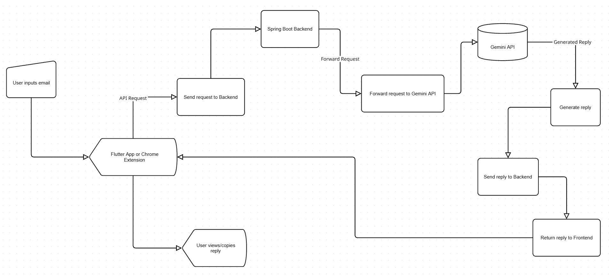

# 📧 Replai – AI-Powered Email Reply Generator  

Replai is a **productivity-focused AI tool** that generates **context-aware, tone-specific email replies** in seconds.  
It is designed to eliminate the repetitive effort of drafting responses and helps professionals **communicate faster, smarter, and more effectively**.  

Built with a **Flutter frontend (Web + Mobile)**, a **Spring Boot backend**, and **Gemini API integration**, Replai also comes with a **Chrome Extension** so you can draft replies directly inside Gmail. 

---

## 🌟 Why Replai?  

Writing emails often consumes unnecessary time. People struggle with:  

- Choosing the right **tone** (formal vs casual).  
- Maintaining **consistency** in professional communication.  
- **Rewriting repetitive replies** multiple times a day.  

Replai solves this problem by:  
- Generating **ready-to-send responses instantly**.  
- Allowing **tone customization** based on your context.  
- Making replies available **anywhere** – Web, Mobile, and Gmail.  

---
## 🏗️ Architecture  

Replai follows a modular architecture combining **Frontend (Flutter Web + Mobile, Chrome Extension)**, **Backend (Spring Boot)**, and **AI (Gemini API)** to deliver seamless email reply generation.  

### 🔄 System Flow  
  

- **User** → Inputs email text & selects tone  
- **Flutter App / Chrome Extension** → Sends request to backend  
- **Spring Boot Backend** → Handles logic and forwards to Gemini API  
- **Gemini API** → Generates AI-powered reply  
- **Backend** → Sends reply back to frontend  
- **User** → Views or directly inserts reply into Gmail

## 📂 Project Structure
```bash
Replai/
├── email-writer/               # Spring Boot server
├── email_writer_flutter/       # Flutter Web + Mobile app
├── email-writer-extention/     # Chrome extension
├── screenshots/                # Previews
└── README.md                   # Documentation
```

---

## ⚙️ Features  

🤖 **AI-Powered Email Generation** – Generates instant, context-aware replies.  
🎭 **Tone Control** – Choose from multiple tones: formal, friendly, casual, persuasive, etc.  
📋 **Clipboard Copy** – Copy replies with one tap/click.  
🌐 **Cross-Platform** – Works on Web, Android, iOS.  
🧩 **Chrome Extension** – Reply inside Gmail without switching apps.  
⚡ **Backend Reliability** – Built with Spring Boot for scalability.  
✨ **Gemini API Integration** – Smart, natural, and human-like responses.  

---

## 🛠️ Tech Stack  

- **Frontend (App):** Flutter (Web + Android + iOS)  
- **Backend:** Spring Boot (Java, Maven)  
- **AI:** Gemini API (Google)  
- **State Management (Flutter):** GetX  
- **UI:** Material Design + Custom Widgets  
- **Extension:** Chrome Manifest v3 (JavaScript, HTML, CSS)  

---

## ⚡ Setup Chrome Extension  

1. Open Chrome → `chrome://extensions/`  
2. Enable **Developer Mode** (top-right).  
3. Click **Load unpacked**.  
4. Select the `chrome-extension/` folder.  
5. Done 🚀 – Extension appears in your toolbar.  

---

## 🎮 Usage  

1. Open **Replai** (Web, Mobile, or Extension).  
2. Paste or type the **incoming email text**.  
3. Select a **tone** (formal, casual, etc.).  
4. Click **Generate Reply**.  
5. Copy to clipboard or directly paste in **Gmail (via extension)**.  

---

## ♻️ Contributing

Thanks for wanting to contribute! Please:

1. Fork the repo
2. Create a branch: `git checkout -b feature/short-description`
3. Commit: `git commit -m "Add: short description"`
4. Push: `git push origin feature/short-description`
5. Open a Pull Request describing the change

Please run tests and update docs as needed.

---

## 🙏 Acknowledgements  

- **Flutter** — Cross-platform app development  
- **Spring Boot** — Scalable backend framework  
- **Gemini API** — AI-powered natural language generation  
- **GetX** — State management for Flutter  
- **Chrome Extension API (Manifest v3)** — Browser integration  
- **Open Source Community** — Libraries, tools & support   

---

## 👨‍💻 Author  

Developed by **Abbas Ansari** ✨  
- 💼 [LinkedIn](https://www.linkedin.com/in/abbas-ansari/)  
- 💻 [GitHub](https://github.com/abbasdx)  
- 📩 Email: abbasxansari@gmail.com  
